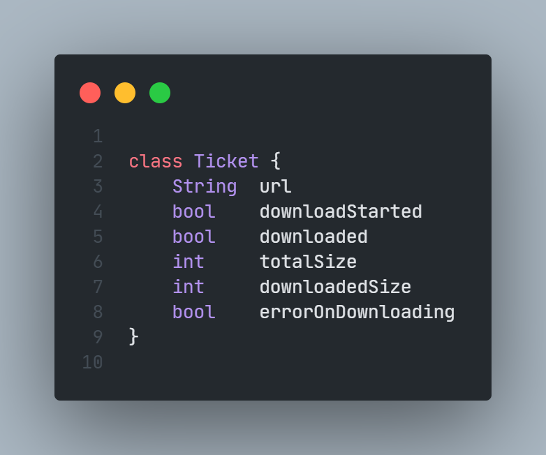
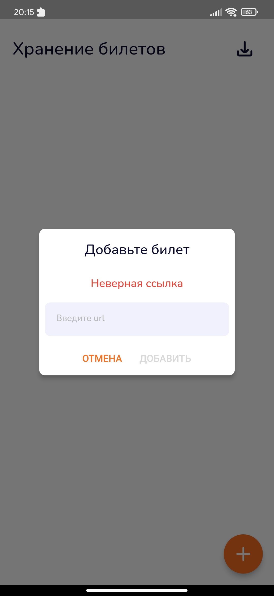
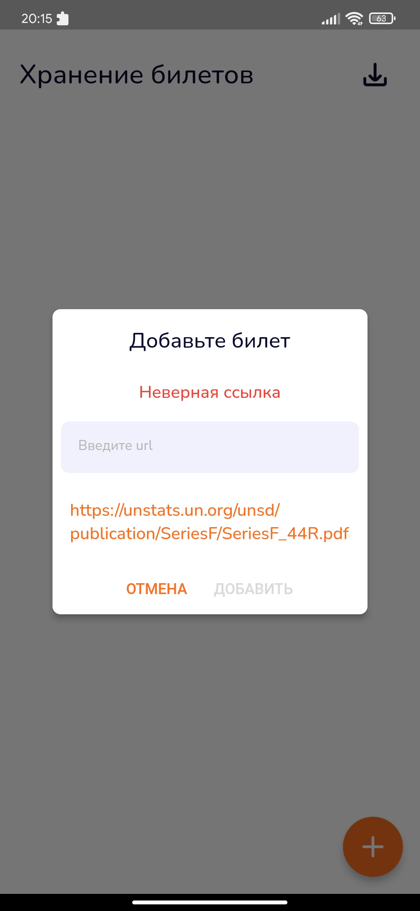
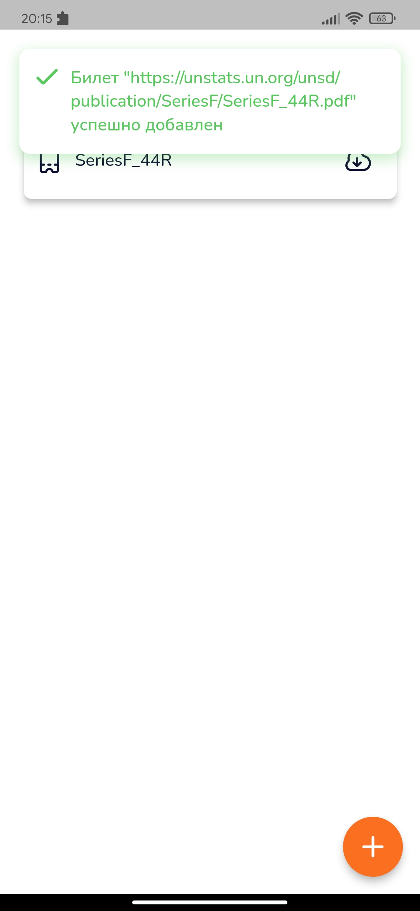
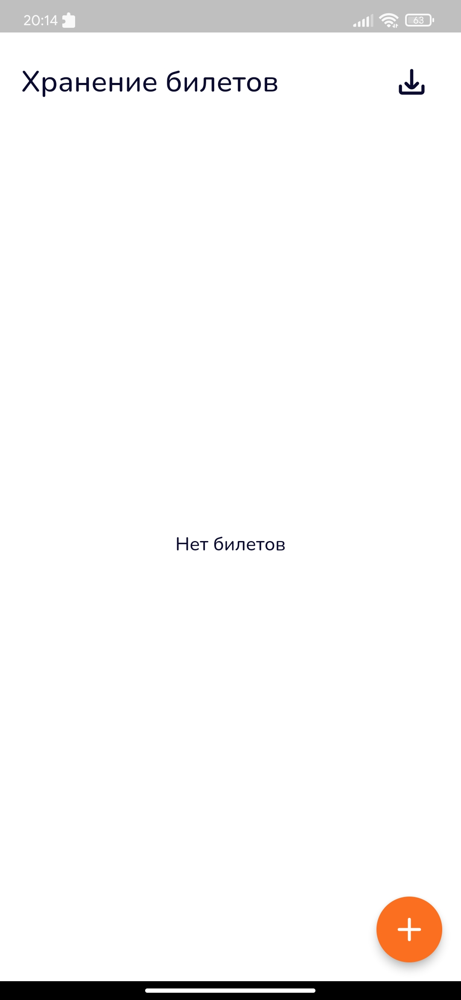
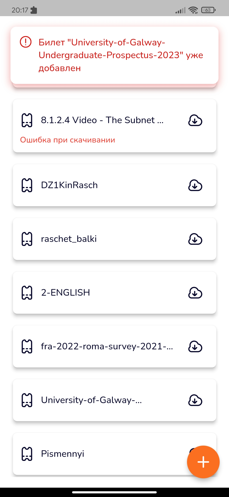
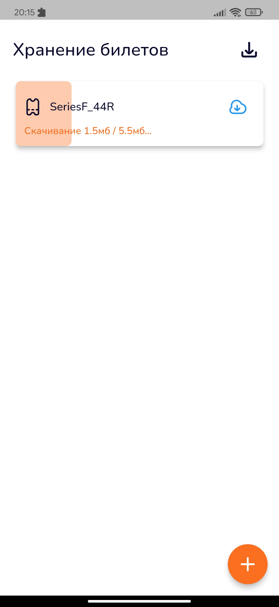
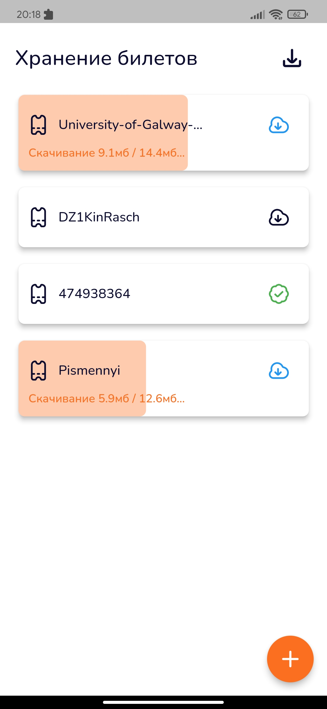
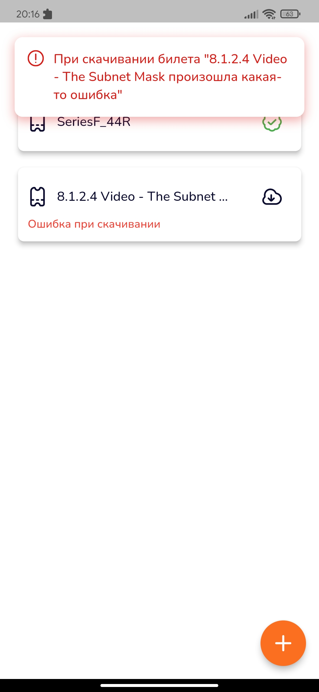
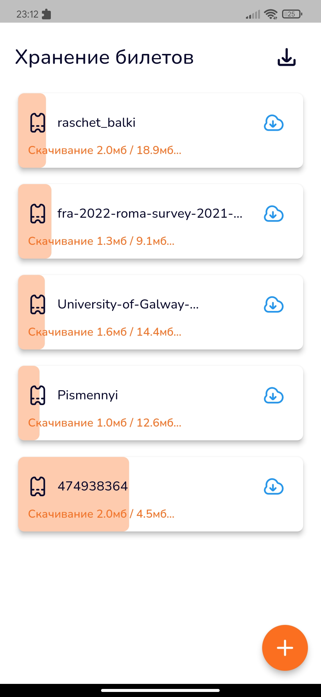

# Surf Study Jam 2023, **~~Lagging~~Tickets Screen** by *ebobola-dev*

# Целевая платформа
Приложение отлаживал на реальном android-устройстве Xiaomi Redmi Not 8 Pro

# Результаты
## Что я успел сделать и как оно работает
- Экран списка билетов
- Модальное окно для добавления нового билета
	- Нельзя добавить билет, который уже есть в списке (url каждого билета является уникальным)
- Вставка ссылки на билет из буфера обмена, если такова имеется в буфере
	- Если в буфере обмена имеется текст, и он проходит валидацию как ссылка на pdf-файл, пользователю предлагается использовать его
- Валидация ссылки
	- Ссылка валидна, если Uri.parse может её скушать без ошибок и она оканчивается на .pdf (да, есть ссылки на файлы без расширений, но я решил их обделить)
- Карточка билета с иконкой, названием, кнопкой загрузки
- Скачивание билета (файла)
	- Реализовал при помощи пакета Dio
	- При ошибке, прогресс скачивания будет сброшен, и билет можно попытаться скачать заново
- Скачивание всех нескачанных билетов по одной кнопке
	- Реализовал на скорую руку, за 10 минут до окончания дедлайна, можно сказать не реализовал, скачиваться будут все билеты, даже уже скачанные(
- Кнопка загрузки недоступна для нажатия, если билет скачивается или уже успешно скачан
	- Иконка кнопки также меняется, в зависимости от того скачивается ли файл, уже скачан или его скачивание ещё не начато
- Индикатор прогресса загрузки в байтах/мегабайтах с общим весом файла
	- Индикатор реализовал как фоновую заливку карточки, которая заполняет всю карточку по мере скачивания (заливка видна только во время скачивания, если скачивание завершено или произошла ошибка, заливка убирается)
	- Индикатор прогресса со скачанным и полным размером выезжает под основными данными в карточке, он убирается когда скачивание завершается, если во время скачивания произошла ошибка, вместо размеров файла, будет показываться сообщение об ошибке
- Билеты сохраняются в локальной базе данных
	- В качество локальной базы данных использовал sqlite, я работал только с hive и sqlite (а ещё с shared preferences xD), выбрал sqlite, так как в hive данные сохраняются по ключам и автоматически сортируются по этим ключам, мне важно было сохранить порядок билетов в списке, если бы я дошёл до сортировки билетов по дате добавления (начал бы реализовывать это), порядок в базе данных был бы уже не важен, и, возможно, я бы использовал hive, а может и нет)
	- Url является уникальным полем каждого билета
	- При открытии приложения, когда билеты читаются из базы данных, если имеется билет, скачивание которого не завершено, его прогресс скачивания сбрасывается, так как мы не может докачать билет после открытия (перезапуска) приложения, ну по крайней мере я не могу), также если в базе данных имеется скачанный билет, но его нет на устройстве (могли удалить и т.д.), то этот билет также помечается как нескачанный
	- Наличие ошибки при скачивании билета также сохраняется в базе данных, после открытия (перезапуска) приложения, пользователь увидит, что при прошлой попытке скачать билет, возникла ошибка

## Что сделано плохо (по моему мнению), нужно доделать/переделать
- Самое печальное, что при изменении данных любого одного тикета, перерисовываются все карточки тикетов, так как я использовал State Notifier и не досмыслил как можно реализовать слушание каждого билета в отдельности, кроме как на каждый новый билет создавать новый State Notifier (мне это кажется плохой идеей), благодаря этому приложение в режиме дебага мега лагучее, особенно при скачивании нескольких файлов одновременно
- Кнопка скачивания всех нескачанных файлов скачивает абсолютно все билеты... не досмотрел, делал торопясь
- При сбросе прогресса загрузки, а также скачивании файла, я не обращаю внимания на реальное хранилище файлов на устройстве, не отчищаю файлы, прогресс загрузки которых сбросил, не проверяю существуют ли уже файлы, которые я хочу скачать
- Некоторые виджеты и код выглядят костыльно, потому что у меня было мало времени причёсывать код (об этом в конце), также в некоторых моментах я упустил важные моменты, о которых писал выше, в итоге и задание не доделал и то что сделал, не доделал........

## Что я не успел сделать
- Пауза при скачивании файла
- Скрытие кнопки добавления ссылки, когда долистали до конца списка
- Сортировка билетов по дате добавления
- Удаление билета и его файла из хранилищ
- Выбор нескольких билетов и разные взаимодействия с группой билетов (скачивание/удаление)
- Открытие pdf-файла на отдельном экране

## Немного внутренностей
#### Модель билета

- **url** - ссылка на файл билета, является уникальной для каждого билета, **никогда не изменяется**
- **downloadStarted** - по умолчанию false, ставиться на true, когда начинается скачивание, при успешном скачинвании также остается true, навсегда..., при ошибке скачивания меняется обратно на false (при возникновении ошибки прогресс скачивания сбрасываю), также если файл недокачан и приложение закрылось (прям с концами), при открытии приложения и чтении из базы данных, также меняю на false (При открытии (перезапуске) приложения прогресс недокачанных файлов сбрасываю), **каждое изменение, меняет данные в базе данных**
- **downloaded** - по умолчанию false, ставиться на true, только когда скачивание успешно завершено, при открытии приложения и чтении билетов из базы данных меняю на false (а вот в базе данных не меняю, потому что забыл/не успел), если билета на самом деле нет в файлах на устройтве (удалили и т.д.), **в базе данных меняется один раз при успешном скачивании файла**
- **totalSize** - полный размер файла в байтах, по умолчанию 1, когда начинается скачивание и мы узнаём от Dio сколько весит файл, ставлю настоящее значение, после этого не меняется, **в базе данных меняется один раз при скачивании файла**
- **downloadedSize** - размер скачанной части файла в байтах, по умолчанию 0, во время скачивания меняется миллион раз, при успешном скачивании становиться равным **totalSize**, обнулять его при обнулении прогресса скачивания я естественно тоже забыл/не успел, **в базе данных меняется только при успешном скачивании файла**
- **errorOnDownloading** - флаг, который поднимается при возникновении ошибки во время скачивания файла, по умолчнанию false, сбрасывается обратно в false, при повторной попытке скачивания, **каждое изменение, меняет данные в базе данных**
 
 
Пробовал использовать вашу архитектуру Elementary, сейчас активно её изучаю) Но не везде, где нужно было, применил её.
 
Использовал пакет another_flushbar, для снекбара сверху экрана.
 
Для всех моделей которым нужно сравнение или копирование использровал Frezzed.
 
Так как у меня всего один экран, данные хранятся только в нём, если было бы несколько экранов, для хранения и передачи данных использовал бы Provider, если данных было бы больше, возможно попробовал бы что-нибудь другое.
 
В качестве тестовых ссылок на билеты использовал просто рандомные ссылки на pdf-файлы)
 
За работу сел сразу как только ёё скинули и закончил в 8 вечера с двумя перерывами на ~час и ~30 минут, перерывы были вынужденные и возможно из-за них мне не хватило времени выполнить остальные пункты(
 
 
# Скриншоты

||
:-------------------------:|:-------------------------:|:-------------------------:
Окно добавления билетов | Если в буфере есть ссылка | Добавили билет

 
 

||
:-------------------------:|:-------------------------:|:-------------------------:
Пустой список билетов | Билет уже в списке | Скачивание билета

 
 

||
:-------------------------:|:-------------------------:|:-------------------------:
Скачивание нескольких билетов | Ошибка при скачивании | Скачивание всех билетов
